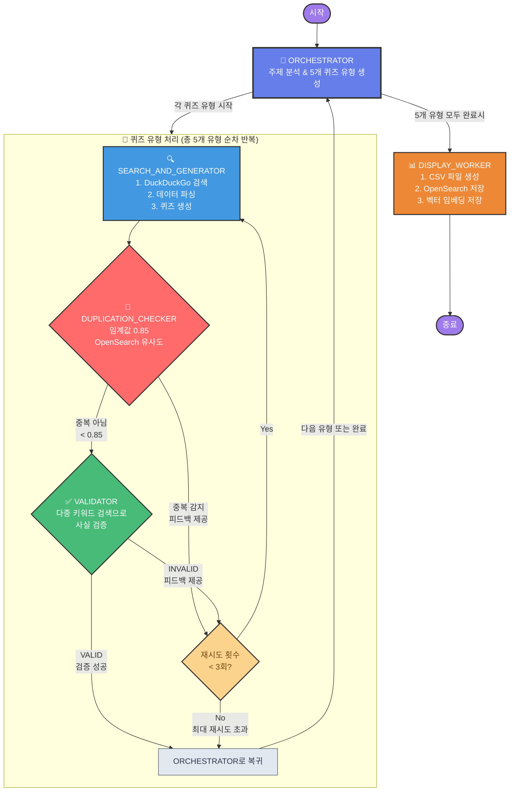

# K-pop Quiz Generator

LangGraph와 Amazon Bedrock을 활용한 K-pop 퀴즈 생성기입니다.

## 주요 기능

- **자동 퀴즈 생성**: K-pop 관련 주제에 대한 객관식 퀴즈 자동 생성
- **다중 키워드 검증**: DuckDuckGo 검색을 통한 퀴즈 정확성 검증
- **LangGraph 워크플로우**: 체계적인 퀴즈 생성 및 검증 프로세스
- **한국어 지원**: 한국어 검색 결과를 통한 정확한 정보 검증

## 워크플로우 다이어그램



## 시스템 구조

### LangGraph 워크플로우 노드
1. **orchestrator**: 전체 프로세스 조율 및 상태 관리
2. **search_and_generate**: 퀴즈 생성 및 초기 검색
3. **validation_worker**: 다중 키워드 검증 시스템
4. **display_worker**: 최종 결과 출력 및 포맷팅

### 검증 시스템 특징
- LLM이 퀴즈 내용을 분석하여 3-5개의 검증 키워드 생성
- 각 키워드로 개별 DuckDuckGo 검색 실행 (`region="kr-kr"`)
- 검색 결과를 종합하여 교차 검증
- 최대 3번 재시도 메커니즘 (피드백 기반 개선)
- `recursion_limit=200` 설정으로 무한 루프 방지


## 📋 각 노드의 역할

### 1. orchestrator (오케스트레이터)
```python
def orchestrator(state: State):
```
역할: 전체 퀴즈 생성 프로세스를 관리하는 중앙 제어기

주요 기능:
• 초기 실행 시: 사용자 토픽을 분석하여 3-5개의 하위 퀴즈 작업(subtasks) 생성
• 각 subtask는 {idol, quiz_type, search_keyword} 구조
• 퀴즈 타입: military_discharge, song_matching, latest_song, lyrics_blank, true_false 등
• 현재 처리할 퀴즈 인덱스 관리 및 다음 퀴즈로 진행

### 2. search_and_generate (검색+생성 워커)
```python
def search_and_generate(state: State):
```
역할: 검색을 통해 정보를 수집하고 퀴즈를 생성

2단계 프로세스:
1. 검색 단계: 
   • LLM이 최적화된 한국어 검색 키워드 생성
   • DuckDuckGo API로 region="kr-kr" 설정하여 한국어 검색
   • 검색 결과를 JSON으로 파싱

2. 퀴즈 생성 단계:
   • 검색된 정보를 바탕으로 LLM이 퀴즈 생성
   • 형식: {QuizID, Category, QuestionID, Type, Question, Options, IsCorrect}
   • 재시도 시 이전 피드백을 반영하여 개선된 퀴즈 생성

### 3. validation_worker (검증 워커)
```python
def validation_worker(state: State):
```
역할: 생성된 퀴즈의 정확성을 다각도로 검증

4단계 검증 프로세스:
1. 키워드 생성: LLM이 퀴즈 검증용 3-5개 키워드 생성
2. 다중 검색: 각 키워드로 개별 검색 (키워드당 2개 결과)
3. 결과 취합: 모든 검색 결과를 종합적으로 분석
4. LLM 검증: 다양한 소스의 정보를 교차 검증하여 VALID/INVALID 판정

### 4. display_worker (표시 워커)
```python
def display_worker(state: State):
```
역할: 완성된 퀴즈들을 CSV 형식으로 변환 및 파일 저장

## 🔀 라우팅 로직

### **route_after_validation**
```python
def route_after_validation(state: State):
    if validation_success:
        return "success"  # → orchestrator (다음 퀴즈타입)
    elif retry_feedback:
        return "retry"    # → search_and_generate (재시도)
```

### **route_after_orchestrator**
```python
def route_after_orchestrator(state: State):
    if all_completed:
        return "display"   # → display_worker (CSV 생성)
    else:
        return "generate"  # → search_and_generate (퀴즈 생성)
```

## 🔄 재시도 메커니즘

1. 검증 실패 시: validation_success=False → search_and_generate로 재시도
2. 최대 3번 재시도: 초과 시 해당 퀴즈타입 건너뛰기
3. 피드백 기반 개선: 실패 이유를 다음 시도에 반영

## 📊 State 관리

```python
class State(TypedDict):
    topic: str                          # 사용자 입력 주제
    all_subtasks: List[QuizSubTask]     # 전체 퀴즈 작업 목록
    current_subtask_index: int          # 현재 처리 중인 인덱스
    current_subtask: QuizSubTask        # 현재 처리 중인 작업
    current_quiz: dict                  # 현재 생성된 퀴즈
    completed_quizzes: List[dict]       # 완성된 퀴즈들
    final_output: str                   # 최종 CSV 출력
    
    # 제어 플래그
    all_completed: bool                 # 모든 작업 완료 여부
    retry_feedback: str                 # 재시도용 피드백
    validation_success: bool            # 검증 성공 여부
    retry_count: int                    # 현재 재시도 횟수
```

## ⚙️ 설정

• **Recursion Limit**: 200 (무한 루프 방지)
• **한국어 검색**: region="kr-kr"
• **LLM**: Amazon Bedrock Claude 3.7 Sonnet
• **최대 재시도**: 3번


## 설치 및 실행

### 1. 저장소 클론
```bash
git clone https://github.com/blait/GenAI-quiz-Gen.git
cd GenAI-quiz-Gen
```

### 2. 가상환경 생성 (권장)
```bash
python -m venv myenv
source myenv/bin/activate  # macOS/Linux
# 또는
myenv\Scripts\activate     # Windows
```

### 3. 의존성 설치
```bash
pip install -r requirement.txt
```

### 4. 설정 파일 생성
```bash
# config.example.py를 복사하여 config.py 생성
cp config.example.py config.py

# config.py 파일을 열어서 본인의 OpenSearch 엔드포인트로 수정
# OPENSEARCH_ENDPOINT = "your-collection-id.us-east-1.aoss.amazonaws.com"
```

### 5. AWS 자격 증명 설정
다음 중 하나의 방법으로 AWS 자격 증명을 설정하세요:

#### 방법 1: AWS CLI 설정
```bash
aws configure
```

#### 방법 2: 환경 변수 설정
```bash
export AWS_ACCESS_KEY_ID=your_access_key
export AWS_SECRET_ACCESS_KEY=your_secret_key
export AWS_DEFAULT_REGION=us-east-1
```

#### 방법 3: .env 파일 생성 (선택사항)
```bash
# .env 파일 생성
AWS_ACCESS_KEY_ID=your_access_key
AWS_SECRET_ACCESS_KEY=your_secret_key
AWS_DEFAULT_REGION=us-east-1
```

### 6. 실행
```bash
python quiz_generator.py
```

## 필요 패키지 (requirement.txt)

```
langgraph
langchain
langchain-aws
boto3
ddgs
opensearch-py
sentence-transformers
```

## 파일 구조

```
GenAI-quiz-Gen/
├── quiz_generator.py      # 메인 퀴즈 생성기 (LangGraph 워크플로우)
├── requirement.txt        # 필요 패키지 목록
├── bts_quiz_output.csv   # 생성된 퀴즈 결과 예시
├── README.md             # 프로젝트 설명서
└── .gitignore           # Git 무시 파일 목록
```

## 사용 예시

프로그램을 실행하면 다음과 같은 과정을 거칩니다:

1. **주제 입력**: K-pop 관련 주제 입력 (예: "BTS", "블랙핑크", "K-pop 역사")
2. **퀴즈 생성**: LLM이 객관식 퀴즈 생성
3. **검증 과정**: 
   - 검증 키워드 자동 생성
   - 한국어 검색 실행
   - 정확성 검증
4. **결과 출력**: 검증된 퀴즈를 CSV 파일로 저장

## 주요 개선사항

- ✅ DuckDuckGo 검색 API를 한국어로 설정 (`region="kr-kr"`)
- ✅ 단일 검색에서 다중 키워드 검증으로 개선
- ✅ Recursion limit을 200으로 증가하여 무한 루프 방지
- ✅ 피드백 기반 재시도 메커니즘 구현
- ✅ 상태 관리 시스템 개선 (`validation_success` 플래그)

## 기술 스택

- **LangGraph**: 워크플로우 관리 및 상태 추적
- **Amazon Bedrock**: LLM 서비스 (Claude 3.5 Sonnet)
- **DuckDuckGo Search**: 실시간 정보 검증
- **Python**: 메인 개발 언어
- **Boto3**: AWS SDK


## 문제 해결

### 일반적인 오류

1. **AWS 자격 증명 오류**
   ```
   NoCredentialsError: Unable to locate credentials
   ```
   → AWS 자격 증명을 올바르게 설정했는지 확인하세요.

2. **패키지 설치 오류**
   ```
   pip install 실패
   ```
   → 가상환경을 사용하고 Python 3.8+ 버전인지 확인하세요.

3. **검색 결과 없음**
   → 네트워크 연결을 확인하고 다른 키워드로 시도해보세요.


## 실행 Sample output

```
그래프 실행 시작: 전체 프로세스 시작
[orch]오케스트레이터 시작: 토픽 처리 중 - Generate 5 quizzes about BTS
[orch]LLM 호출: sub-task 생성 중...
[orch]LLM 응답 원본: [
  {
    "idol": "BTS",
    "quiz_type": "military_discharge",
    "search_keyword": "BTS military discharge dates"
  },
  {
    "idol": "BTS",
    "quiz_type": "song_matching",
    "search_keyword": "BTS title tracks and albums"
  },
  {
    "idol": "BTS",
    "quiz_type": "lyrics_blank",
    "search_keyword": "BTS popular song lyrics"
  },
  {
    "idol": "BTS",
    "quiz_type": "true_false",
    "search_keyword": "BTS facts achievements records"
  },
  {
    "idol": "BTS",
    "quiz_type": "kpop_history",
    "search_keyword": "BTS debut history milestones"
  }
]
[orch]sub-tasks 생성 완료: [{'idol': 'BTS', 'quiz_type': 'military_discharge', 'search_keyword': 'BTS military discharge dates'}, {'idol': 'BTS', 'quiz_type': 'song_matching', 'search_keyword': 'BTS title tracks and albums'}, {'idol': 'BTS', 'quiz_type': 'lyrics_blank', 'search_keyword': 'BTS popular song lyrics'}, {'idol': 'BTS', 'quiz_type': 'true_false', 'search_keyword': 'BTS facts achievements records'}, {'idol': 'BTS', 'quiz_type': 'kpop_history', 'search_keyword': 'BTS debut history milestones'}]
[search_gen]검색+생성 워커 시작: BTS - military_discharge
[search_gen]1단계: 검색 시작
[search_gen]-[search_prompt] : input_variables=[] input_types={} partial_variables={} messages=[SystemMessage(content='퀴즈 유형과 아이돌을 기반으로 DuckDuckGo API에 최적화된 검색 키워드를 한국어로 생성하세요. 관련이 있다면 현재 날짜 2025-07-25를 포함하세요. 키워드 문자열만 출력하세요.', additional_kwargs={}, response_metadata={}), HumanMessage(content='아이돌: BTS, 유형: military_discharge, 초기 키워드: BTS military discharge dates', additional_kwargs={}, response_metadata={})]
[search_gen]한국어 검색 실행: BTS 진 뷔 RM 지민 제이홉 슈가 정국 군대 제대일 전역일정 2025년
[search_gen]검색 결과 수신: [{'title': 'BTS 진 12일 전역, RM, 슈가, 제이홉, 지민, 뷔, 정국 입대일, 전역일...', 'href': 'https://hola0829.tistory.com/entry/BTS-진-12일-전역-RM-슈가-제이홉-지민-뷔-정국-입대일-전역일-총-정리', 'body': 'Jun 2, 2024 · 가장 늦게 입대한 지 민과 정 국 전역 일 은 2025 년 6월 11일로, 뷔 와 RM 전역 일과 1일 차이가 난다. BTS 멤버들이 다음주 6월 12일 (수) 진의 제대를 시작으로 제 이 홉 , 뷔 , RM , 정 국 , 지 민 , 슈 가 순으로 전역이 예정되어 있다.'}, {'title': '25년 6월 BTS 전원 제대 일정과 완전체 복귀, 하이브 주가전망 총정리...', 'href': 'https://blog.naver.com/dreaming_ant/223886141574', 'body': 'Jun 25, 2025 · 그룹 방탄소년단 ( B TS )이 6월을 기점으로 전원 제 대를 앞두고 완전체 복귀를 예고하고 있습니다. 2 년 넘게 이어졌던 군 복무 공백이 마무리되면서 글로벌 음악시장뿐 아니라 국내 증시에서도 BTS 컴백이 중요한 변수로 부각되고 있는데요.'}, {'title': 'BTS 전역 넘넘 기다렸어요. 슈가, RM, 뷔, 정국, 지민 전역 그래서 얼...', 'href': 'https://www.cosmopolitan.co.kr/article/1876813', 'body': 'Feb 5, 2025 · 2025 년 은 BTS 전역 의 해! 진, 제 이 홉 은 이미 우리 품에, 남은 다섯 멤버 슈 가 , RM , 뷔 , 정 국 , 지 민 도 올해 전역 을 앞두고 있다.'}, {'title': 'BTS 군대 순서 제대일(전역일), 입대일, 부대 정보 정리 멤버 전원', 'href': 'https://dealbom.com/entry/BTS군대', 'body': 'Jan 25, 2024 · 전역 예정일은 2025 년 6월 11일 입니다. 둘 다 제5보병사단 신병교육대로 입소했고 그대로 제5보병사단으로 자대배치를 받아 군복무 중입니다.'}, {'title': 'BTS 군대 전역일 총정리 (진, 정국, 뷔, RM, 슈가, 지민, 제이홉)', 'href': 'https://borylove.com/entry/BTS-군대-전역일-총정리-진-정국-뷔-RM-슈가-지민-제이홉', 'body': 'Mar 30, 2025 · 지 민 과 정 국 도 같은 날 현역으로 입대하여 2025 년 6월 11일 전역 예정이고, 뷔는 특전사에 자원하여 고된 복무를 수행 중이며 역시 같은 날 전역하게 됩니다. 이처럼 멤버들은 각각 다른 시점과 방식으로 입대했지만, 모두 병역 의무를 성실히 이행하고 있습니다.'}]개 결과
[search_gen]검색 데이터 파싱 완료
[search_gen]2단계: 퀴즈 생성 시작
그래프 실행 중 에러 발생: get expected at most 2 arguments, got 3
(myenv)  AWS: default  hyeonsup@c889f3b517c4  ~/idolquiz  python3 quiz_generator.py
그래프 실행 시작: 전체 프로세스 시작
[orch]오케스트레이터 시작: 토픽 처리 중 - Generate 5 quizzes about BTS
[orch]LLM 호출: sub-task 생성 중...
[orch]LLM 응답 원본: [
  {
    "idol": "BTS",
    "quiz_type": "military_discharge",
    "search_keyword": "BTS military enlistment discharge dates"
  },
  {
    "idol": "BTS",
    "quiz_type": "song_matching",
    "search_keyword": "BTS hit songs album names"
  },
  {
    "idol": "BTS",
    "quiz_type": "latest_song",
    "search_keyword": "BTS most recent music release 2025"
  },
  {
    "idol": "BTS",
    "quiz_type": "lyrics_blank",
    "search_keyword": "BTS popular song lyrics"
  },
  {
    "idol": "BTS",
    "quiz_type": "kpop_history",
    "search_keyword": "BTS achievements history milestones"
  }
]
[orch]sub-tasks 생성 완료: [{'idol': 'BTS', 'quiz_type': 'military_discharge', 'search_keyword': 'BTS military enlistment discharge dates'}, {'idol': 'BTS', 'quiz_type': 'song_matching', 'search_keyword': 'BTS hit songs album names'}, {'idol': 'BTS', 'quiz_type': 'latest_song', 'search_keyword': 'BTS most recent music release 2025'}, {'idol': 'BTS', 'quiz_type': 'lyrics_blank', 'search_keyword': 'BTS popular song lyrics'}, {'idol': 'BTS', 'quiz_type': 'kpop_history', 'search_keyword': 'BTS achievements history milestones'}]
[search_gen]검색+생성 워커 시작: BTS - military_discharge
[search_gen]1단계: 검색 시작
[search_gen]-[search_prompt] : input_variables=[] input_types={} partial_variables={} messages=[SystemMessage(content='퀴즈 유형과 아이돌을 기반으로 DuckDuckGo API에 최적화된 검색 키워드를 한국어로 생성하세요. 관련이 있다면 현재 날짜 2025-07-25를 포함하세요. 키워드 문자열만 출력하세요.', additional_kwargs={}, response_metadata={}), HumanMessage(content='아이돌: BTS, 유형: military_discharge, 초기 키워드: BTS military enlistment discharge dates', additional_kwargs={}, response_metadata={})]
[search_gen]한국어 검색 실행: BTS 군복무 전역일 일정 2025년
[search_gen]검색 결과 수신: [{'title': '️ BTS 전원 전역! 완전체 복귀 D-?? / BTS 멤버 전역 일정 총정리', 'href': 'https://raekki.tistory.com/entry/🎖️-BTS-전원-전역-완전체-복귀-D-얼마-BTS-멤버-전역-일정-총정리', 'body': 'Jun 16, 2025 · 빅히트뮤직 공식 입장 (2023년) “ 2025 년 상반기 중 모든 멤버가 복 무 를 마치는 시점 이후, BTS 의 완전체 활동을 목표로 하고 있습니다.” 2025 하반기 부터는 단독 콘서트 정규 앨범 예능/다큐 콘텐츠 등 다양한 7인 활동 재개 가능성이 매우 높습니다.'}, {'title': 'BTS 완전체 컴백 D-DAY는? 멤버별 군 복무 & 전역일 총정리', 'href': 'https://easydaill.tistory.com/23', 'body': 'May 16, 2025 · 드디어 맏형 진의 전역 으로 BTS 완전체 컴백에 대한 기대감이 최고조에 달하고 있죠? 2025 년 올해가 될 BTS 복귀 곧 난리 날 예정 !!그래서 준비했습니다!'}, {'title': '2025 BTS 군백기 끝! 멤버별 전역 일정부터 완전체 컴백까지, 아미라...', 'href': 'https://serendipitousdiscovery.tistory.com/entry/2025-BTS-군백기-끝-멤버별-전역-일정부터-완전체-컴백까지-아미라면-꼭-알아야-할-모든-것', 'body': 'Jun 9, 2025 · 드디어 기다리고 기다리던 그 순간이 다가오고 있어요. 2023년부터 시작된 BTS 멤버들의 군 입대, 그리고 그로 인한 군 백기…'}, {'title': 'BTS 군대 제대 전역일 멤버 총정리 (+1초확인) : 네이버 블로그', 'href': 'https://m.blog.naver.com/shbg0226/223478638508', 'body': 'Jun 13, 2024 · 슈가는 과거 교통사고로 인해 어깨 상완골 탈구 진단을 받아 사회복무요원으로 복무하고 있어요. 2023년 9월 22일부터 복무를 시작했고, 제대일자는 2025 년 6월 21일이라고 해요.'}, {'title': '2025년 BTS 군대 전역 후 완전체 복귀 일정과 활동 계획', 'href': 'https://jirmgil.com/entry/2025년-BTS-완전체-복귀-일정과-활동-계획', 'body': "Jun 8, 2025 · 방탄소년단 ( B TS )의 전 멤버가 군 복무를 마치고 한자리에 모이게 되는 '완전체 복귀'가 현실로 다가온 거예요. 맏형 진과 제이홉은 이미 군 복무를 끝냈고, RM, 뷔, 지민, 정국, 슈가는 2025 년 6월 중순을 기점으로 순차적으로 전역 하게 되죠."}]개 결과
[search_gen]검색 데이터 파싱 완료
[search_gen]2단계: 퀴즈 생성 시작
그래프 실행 중 에러 발생: get expected at most 2 arguments, got 3
(myenv)  AWS: default  hyeonsup@c889f3b517c4  ~/idolquiz  python3 quiz_generator.py
그래프 실행 시작: 전체 프로세스 시작
[orch]오케스트레이터 시작: 토픽 처리 중 - Generate 5 quizzes about BTS
[orch]LLM 호출: sub-task 생성 중...
[orch]LLM 응답 원본: [
  {
    "idol": "BTS",
    "quiz_type": "military_discharge",
    "search_keyword": "BTS members military service discharge dates"
  },
  {
    "idol": "BTS",
    "quiz_type": "song_matching",
    "search_keyword": "BTS title tracks albums matching"
  },
  {
    "idol": "BTS",
    "quiz_type": "lyrics_blank",
    "search_keyword": "BTS popular song lyrics"
  },
  {
    "idol": "BTS",
    "quiz_type": "true_false",
    "search_keyword": "BTS facts achievements history"
  },
  {
    "idol": "BTS",
    "quiz_type": "kpop_history",
    "search_keyword": "BTS debut timeline milestones"
  }
]
[orch]sub-tasks 생성 완료: [{'idol': 'BTS', 'quiz_type': 'military_discharge', 'search_keyword': 'BTS members military service discharge dates'}, {'idol': 'BTS', 'quiz_type': 'song_matching', 'search_keyword': 'BTS title tracks albums matching'}, {'idol': 'BTS', 'quiz_type': 'lyrics_blank', 'search_keyword': 'BTS popular song lyrics'}, {'idol': 'BTS', 'quiz_type': 'true_false', 'search_keyword': 'BTS facts achievements history'}, {'idol': 'BTS', 'quiz_type': 'kpop_history', 'search_keyword': 'BTS debut timeline milestones'}]
[search_gen]검색+생성 워커 시작: BTS - military_discharge
[search_gen]1단계: 검색 시작
[search_gen]-[search_prompt] : input_variables=[] input_types={} partial_variables={} messages=[SystemMessage(content='퀴즈 유형과 아이돌을 기반으로 DuckDuckGo API에 최적화된 검색 키워드를 한국어로 생성하세요. 관련이 있다면 현재 날짜 2025-07-25를 포함하세요. 키워드 문자열만 출력하세요.', additional_kwargs={}, response_metadata={}), HumanMessage(content='아이돌: BTS, 유형: military_discharge, 초기 키워드: BTS members military service discharge dates', additional_kwargs={}, response_metadata={})]
[search_gen]한국어 검색 실행: 방탄소년단 BTS 멤버 군복무 전역일 2025 군 제대 일정 Jin RM SUGA j-hope Jimin V Jungkook
[search_gen]검색 결과 수신: [{'title': 'Naver Blog BTS 군대 제대 전역일 멤버 총정리 (+1초확인) : 네이버 블로그', 'href': 'https://m.blog.naver.com/shbg0226/223478638508', 'body': '2023년 9월 22일부터 복무를 시작했고, 제대일자는 2025년 6월 21일 이라고 해요. 사회복무요원으로서의 복무 기간이 조금 더 길다고 하니, 슈가가 건강하게 잘 지내고 있기를 바라는 마음이 크네요. ... 2023년 4월 18일에 입대하여 ...'}, {'title': 'BBC BTS: RM·지민·V·정국도 군 입대 준비…2025년 재결합 - BBC News 코리아', 'href': 'https://www.bbc.com/korean/articles/cllp11rlg70o', 'body': 'November 23, 2023 - BTS는 오는 2025년 군 복무를 마치고 완전체로 활동할 수 있을 것으로 보인다.'}, {'title': "BBC BTS 복귀 시작: 눈물과 웃음 뒤섞인 맏형 '진'의 육군 만기 전역 현장 - BBC News 코리아", 'href': 'https://www.bbc.com/korean/articles/c2ll81en3jyo', 'body': 'June 12, 2024 - 12일 오전 , 그룹 방탄소년단(BTS)의 맏형 진이 육군 현역으로 군 복무를 마치고 만기 전역했다. 진은 전역 전 병사들과 인사를 나누며 눈물을 흘리기도 했다.'}, {'title': 'Khan All BTS members are in the military - 경향신문', 'href': 'https://www.khan.co.kr/article/202312131727117', 'body': 'December 13, 2023 - Jin will be the first to be discharged next June, followed by J-Hope next October. RM, V, Ji-min, Jung-kook and Suga will leave the army in June 2025 . BTS members RM, V, Jimin, and Jungkook during a group live broadcast on December 5 before they enlisted in the military.'}, {'title': 'The Korea Times All BTS members begin military service, talk of group reunion in 2025 - The Korea Times', 'href': 'https://www.koreatimes.co.kr/learningenglish/culture/20231212/culture-all-bts-members-begin-military-service-talk-of-group-reunion-in-2025-2025', 'body': 'December 12, 2023 - By Pyo Kyung-minFour BTS members — RM , V , Jimin and Jungkook — begin their military duties this week, joining Jin , J - hope and Suga already fulfilling their mandatory service. 방탄소년단 멤버 중 4명인...'}]개 결과
[search_gen]검색 데이터 파싱 완료
[search_gen]2단계: 퀴즈 생성 시작
[search_gen]퀴즈 생성 완료: {'QuizID': 1, 'Category': 'K-pop', 'QuestionID': 1, 'Type': 'multiple_choice', 'Question': '방탄소년단(BTS) 멤버 중 가장 먼저 전역한 멤버는 누구인가요?', 'Options': ['진', '슈가', '제이홉', '정국'], 'IsCorrect': '진'}
[search_gen]검색+생성 완료: BTS - 성공
[val]검증 워커 시작: 퀴즈 검증 중...
[val]State 키들: ['topic', 'all_subtasks', 'current_subtask_index', 'current_subtask', 'current_quiz', 'completed_quizzes', 'retry_count']
[val]current_quiz 존재 여부: True
[val]퀴즈 발견: {'QuizID': 1, 'Category': 'K-pop', 'QuestionID': 1, 'Type': 'multiple_choice', 'Question': '방탄소년단(BTS) 멤버 중 가장 먼저 전역한 멤버는 누구인가요?', 'Options': ['진', '슈가', '제이홉', '정국'], 'IsCorrect': '진'}
[val]1단계: 검증용 키워드 생성
[val]검증 키워드 생성 완료: ['방탄소년단 진 전역', 'BTS 멤버 전역 순서', '방탄소년단 군복무 완료 최초', '진 김석진 BTS 제대', '방탄소년단 군대 전역일']
[val]2단계: 다중 키워드 검색 실행
[val]검색 1/5: 방탄소년단 진 전역
[val]키워드 '방탄소년단 진 전역' 검색 완료: 2개 결과
[val]검색 2/5: BTS 멤버 전역 순서
[val]키워드 'BTS 멤버 전역 순서' 검색 완료: 2개 결과
[val]검색 3/5: 방탄소년단 군복무 완료 최초
[val]키워드 '방탄소년단 군복무 완료 최초' 검색 완료: 2개 결과
[val]검색 4/5: 진 김석진 BTS 제대
[val]키워드 '진 김석진 BTS 제대' 검색 완료: 2개 결과
[val]검색 5/5: 방탄소년단 군대 전역일
[val]키워드 '방탄소년단 군대 전역일' 검색 완료: 2개 결과
[val]전체 검색 결과 수집 완료: 10개 결과
[val]3단계: 검색 결과 취합 및 검증
[val]종합 검증 응답: VALID

여러 검색 결과를 종합한 결과, 방탄소년단(BTS) 멤버 중 진(김석진)이 가장 먼저 전역한 것이 확인됩니다. 특히 "방탄소년단 진, 전역 및 솔로 복귀 계획" 제목의 검색 결과에서 진이 2024년 6월 12일에 군 복무를 마치고 전역했다는 구체적인 정보가 확인됩니다. 다른 멤버들의 전역일에 대한 정보도 있으나, 진이 가장 먼저 입대하여 가장 먼저 전역한 멤버임이 여러 출처에서 일관되게 확인됩니다.

따라서 퀴즈에서 BTS 멤버 중 가장 먼저 전역한 멤버는 진이라는 내용은 정확한 정보입니다.
[val]퀴즈 검증 성공
[route]라우팅 체크: retry_feedback='', validation_success=True
[orch]다음 퀴즈타입 시작: 2/5
[search_gen]검색+생성 워커 시작: BTS - song_matching
[search_gen]1단계: 검색 시작
[search_gen]-[search_prompt] : input_variables=[] input_types={} partial_variables={} messages=[SystemMessage(content='퀴즈 유형과 아이돌을 기반으로 DuckDuckGo API에 최적화된 검색 키워드를 한국어로 생성하세요. 관련이 있다면 현재 날짜 2025-07-25를 포함하세요. 키워드 문자열만 출력하세요.', additional_kwargs={}, response_metadata={}), HumanMessage(content='아이돌: BTS, 유형: song_matching, 초기 키워드: BTS title tracks albums matching', additional_kwargs={}, response_metadata={})]
[search_gen]한국어 검색 실행: BTS 타이틀 곡 앨범 매칭 목록 인기곡 디스코그래피
[search_gen]검색 결과 수신: [{'title': '[해외반응] BTS 정국 첫 솔로앨범 타이틀 곡 Standing Next to You', 'href': 'https://clipsaver.ru/watch/xDGYzKJGTac', 'body': 'Ep66.[해외반응] 끝없이 나오는 해외반응 BTS 정국 \'첫 솔로\' 앨범 Standing Next to You ㅣ"정국을보며 마이클잭슨같다는 해외팬들의 극찬".'}, {'title': '따끈따끈한 정규 2집 타이틀 곡 양다일(Yang Da Il) 의 〈아파...', 'href': 'https://vk.com/video-203089501_456239027', 'body': '따끈따끈한 정규 2집 타이틀 곡 양다일의 〈아파〉#비긴어게인오픈마이크 #양다일 #아파.'}, {'title': 'I Dare U on Twitter: "그리고 영상회 엔딩 편집 영상 곡 타이틀 여쭤보신..."', 'href': 'https://twitter.com/IDAREU_JK/status/1563914496111833088', 'body': 'Show replies. zaina. @zena_ bts 97. · Aug 28.'}, {'title': "솔로 데뷔 데이식스 성진, 타이틀 곡 '체크 패턴'에 쏠리는 기대 - 팬마음...", 'href': 'https://community.fanmaum.com/day6/85805785', 'body': "밴드 데이식스(DAY6) 성진이 솔로 데뷔를 하루 앞두고 타이틀 곡 '체크 패턴(Check Pattern)'의 뮤직비디오 티저를 추가 공개했다.0. 목록 ."}, {'title': "2012년 나얼의 첫 정규 앨범 'Principle of my soul'의 타이틀 곡 ... 나얼...", 'href': 'https://www.youtube.com/watch?v=DmMuQmtBcl8', 'body': ''}]개 결과
[search_gen]검색 데이터 파싱 완료
[search_gen]2단계: 퀴즈 생성 시작
[search_gen]퀴즈 생성 완료: {'QuizID': 1, 'Category': 'K-pop', 'QuestionID': 101, 'Type': 'song_matching', 'Question': 'BTS 정국의 솔로 곡 중 해외 팬들이 마이클 잭슨과 비교하며 극찬했던 타이틀 곡은 무엇인가요?', 'Options': ['Standing Next to You', 'Seven', 'Still With You', 'Euphoria'], 'IsCorrect': 'Standing Next to You'}
[search_gen]검색+생성 완료: BTS - 성공
[val]검증 워커 시작: 퀴즈 검증 중...
[val]State 키들: ['topic', 'all_subtasks', 'current_subtask_index', 'current_subtask', 'current_quiz', 'completed_quizzes', 'retry_feedback', 'validation_success', 'retry_count']
[val]current_quiz 존재 여부: True
[val]퀴즈 발견: {'QuizID': 1, 'Category': 'K-pop', 'QuestionID': 101, 'Type': 'song_matching', 'Question': 'BTS 정국의 솔로 곡 중 해외 팬들이 마이클 잭슨과 비교하며 극찬했던 타이틀 곡은 무엇인가요?', 'Options': ['Standing Next to You', 'Seven', 'Still With You', 'Euphoria'], 'IsCorrect': 'Standing Next to You'}
[val]1단계: 검증용 키워드 생성
[val]검증 키워드 생성 완료: ['BTS 정국 솔로 타이틀곡 마이클 잭슨', 'Standing Next to You 정국 마이클 잭슨 비교', '정국 해외팬 반응 Standing Next to You', 'BTS 정국 솔로곡 리스트', 'Standing Next to You 정국 평가']
[val]2단계: 다중 키워드 검색 실행
[val]검색 1/5: BTS 정국 솔로 타이틀곡 마이클 잭슨
[val]키워드 'BTS 정국 솔로 타이틀곡 마이클 잭슨' 검색 완료: 2개 결과
[val]검색 2/5: Standing Next to You 정국 마이클 잭슨 비교
[val]키워드 'Standing Next to You 정국 마이클 잭슨 비교' 검색 완료: 2개 결과
[val]검색 3/5: 정국 해외팬 반응 Standing Next to You
[val]키워드 '정국 해외팬 반응 Standing Next to You' 검색 완료: 2개 결과
[val]검색 4/5: BTS 정국 솔로곡 리스트
[val]키워드 'BTS 정국 솔로곡 리스트' 검색 완료: 2개 결과
[val]검색 5/5: Standing Next to You 정국 평가
[val]키워드 'Standing Next to You 정국 평가' 검색 완료: 2개 결과
[val]전체 검색 결과 수집 완료: 10개 결과
[val]3단계: 검색 결과 취합 및 검증
[val]종합 검증 응답: VALID

여러 검색 결과에서 BTS 정국의 'Standing Next to You'가 마이클 잭슨과 비교되며 해외 팬들에게 극찬받은 곡임이 확인됩니다. 특히 "다시 한번 마이클 잭슨을 소환한 정국" 기사에서는 이 곡에서 마이클 잭슨에 대한 오마주가 드러난다고 언급하고 있으며, 여러 해외 반응 관련 자료에서도 해외 팬들의 호평이 확인됩니다. 따라서 제시된 퀴즈의 정보는 정확합니다.
[val]퀴즈 검증 성공
[route]라우팅 체크: retry_feedback='', validation_success=True
[orch]다음 퀴즈타입 시작: 3/5
[search_gen]검색+생성 워커 시작: BTS - lyrics_blank
[search_gen]1단계: 검색 시작
[search_gen]-[search_prompt] : input_variables=[] input_types={} partial_variables={} messages=[SystemMessage(content='퀴즈 유형과 아이돌을 기반으로 DuckDuckGo API에 최적화된 검색 키워드를 한국어로 생성하세요. 관련이 있다면 현재 날짜 2025-07-25를 포함하세요. 키워드 문자열만 출력하세요.', additional_kwargs={}, response_metadata={}), HumanMessage(content='아이돌: BTS, 유형: lyrics_blank, 초기 키워드: BTS popular song lyrics', additional_kwargs={}, response_metadata={})]
[search_gen]한국어 검색 실행: BTS 유명 노래 가사 빈칸 채우기 Spring Day Dynamite Butter 인기곡
[search_gen]검색 결과 수신: [{'title': 'Dynamite ( BTS song) - Wikipedia', 'href': 'https://en.wikipedia.org/wiki/Dynamite_(BTS_song)', 'body': '" Dynamite " is a song recorded by South Korean boy band BTS , released on August 21, 2020, through Big Hit Entertainment and Sony Music Entertainment. It is the band\'s first song fully recorded in English. The song was written by David S...'}, {'title': "BTS (방탄소년단) ' Spring Day ' (봄날) Lyrics... - YouTube", 'href': 'https://www.youtube.com/watch?v=H2HQWHKDREI', 'body': "BTS (방탄소년단) ' Spring Day '#겨울지나_다시봄날 #TimelessSpringDay I DO NOT OWN THE MUSICAll Rights Administered by Bighit EntertainmentColor Coded by heyapeach| ..."}, {'title': 'spring day | dynamite | butter 2021 | BTS PAVED THE...', 'href': 'https://vk.com/wall-41523650_1082001', 'body': 'Собрались как-то spring day , dynamite и butter . 6 989 просмотров.Елизавета, хаха а это тупо. На первой фотке butter : 2.'}, {'title': 'PERMISSION TO DANCE ON STAGE (LIVE) - Album by BTS', 'href': 'https://music.apple.com/ng/album/permission-to-dance-on-stage-live/1823627665', 'body': 'It includes 22 tracks that featured on the Permission to Dance on Stage set list, including remixed versions of their 2019 Halsey funk-pop collaboration “Boy with Luv” and English-language hits “ Dynamite ” and “ Butter ” with a live band.'}, {'title': 'MY WORLD BTS – Telegram', 'href': 'https://t.me/my_world_bts7/80230', 'body': 'MY WORLD BTS 6:15 Media is too big VIEW IN TELEGRAM Run Seokjin EP Tour в Далласе D1 Dynamite , Butter , Microcosms and Spring Day .'}]개 결과
[search_gen]검색 데이터 파싱 완료
[search_gen]2단계: 퀴즈 생성 시작
[search_gen]퀴즈 생성 완료: {'QuizID': 1, 'Category': 'K-pop Lyrics', 'QuestionID': 101, 'Type': 'lyrics_blank', 'Question': 'Fill in the blank for BTS\'s \'Dynamite\' lyrics: "Cause I-I-I\'m in the stars tonight, So watch me _____ (bring the fire and set the night alight)"', 'Options': ['bring the fire', 'shine bright', 'dance tonight', 'light it up'], 'IsCorrect': 'bring the fire'}
[search_gen]검색+생성 완료: BTS - 성공
[val]검증 워커 시작: 퀴즈 검증 중...
[val]State 키들: ['topic', 'all_subtasks', 'current_subtask_index', 'current_subtask', 'current_quiz', 'completed_quizzes', 'retry_feedback', 'validation_success', 'retry_count']
[val]current_quiz 존재 여부: True
[val]퀴즈 발견: {'QuizID': 1, 'Category': 'K-pop Lyrics', 'QuestionID': 101, 'Type': 'lyrics_blank', 'Question': 'Fill in the blank for BTS\'s \'Dynamite\' lyrics: "Cause I-I-I\'m in the stars tonight, So watch me _____ (bring the fire and set the night alight)"', 'Options': ['bring the fire', 'shine bright', 'dance tonight', 'light it up'], 'IsCorrect': 'bring the fire'}
[val]1단계: 검증용 키워드 생성
[val]검증 키워드 생성 완료: ['BTS Dynamite lyrics', 'Dynamite BTS fill in blank', 'BTS Dynamite bring the fire', 'Dynamite chorus BTS', 'BTS Dynamite official lyrics']
[val]2단계: 다중 키워드 검색 실행
[val]검색 1/5: BTS Dynamite lyrics
[val]키워드 'BTS Dynamite lyrics' 검색 완료: 2개 결과
[val]검색 2/5: Dynamite BTS fill in blank
[val]키워드 'Dynamite BTS fill in blank' 검색 완료: 2개 결과
[val]검색 3/5: BTS Dynamite bring the fire
[val]키워드 'BTS Dynamite bring the fire' 검색 완료: 2개 결과
[val]검색 4/5: Dynamite chorus BTS
[val]키워드 'Dynamite chorus BTS' 검색 완료: 2개 결과
[val]검색 5/5: BTS Dynamite official lyrics
[val]키워드 'BTS Dynamite official lyrics' 검색 완료: 2개 결과
[val]전체 검색 결과 수집 완료: 10개 결과
[val]3단계: 검색 결과 취합 및 검증
[val]종합 검증 응답: VALID

검색 결과에서 여러 출처가 BTS의 'Dynamite' 가사 중 해당 부분이 "bring the fire"로 시작함을 일관되게 확인할 수 있습니다.

특히 다음 출처들에서 직접적으로 확인됩니다:
- YouTube 가사 영상 설명: "Cause I, I, I'm in the stars tonight So watch me bring the fire and set the night alight"
- 티스토리 블로그 번역 가사: "So watch me bring the fire and set the night alight"
- 다른 한국어 블로그의 파트별 가사: "So watch me bring the fire and set the night alight (BTS)"

따라서 퀴즈의 정답이 "bring the fire"로 표시된 것은 정확합니다.
[val]퀴즈 검증 성공
[route]라우팅 체크: retry_feedback='', validation_success=True
[orch]다음 퀴즈타입 시작: 4/5
[search_gen]검색+생성 워커 시작: BTS - true_false
[search_gen]1단계: 검색 시작
[search_gen]-[search_prompt] : input_variables=[] input_types={} partial_variables={} messages=[SystemMessage(content='퀴즈 유형과 아이돌을 기반으로 DuckDuckGo API에 최적화된 검색 키워드를 한국어로 생성하세요. 관련이 있다면 현재 날짜 2025-07-25를 포함하세요. 키워드 문자열만 출력하세요.', additional_kwargs={}, response_metadata={}), HumanMessage(content='아이돌: BTS, 유형: true_false, 초기 키워드: BTS facts achievements history', additional_kwargs={}, response_metadata={})]
[search_gen]한국어 검색 실행: BTS 방탄소년단 사실 업적 역사 진실 확인 2025
[search_gen]검색 결과 수신: [{'title': "[EPISODE] 진 (Jin) 'RUNSEOKJIN_EP.TOUR' in GOYANG - BTS ...", 'href': 'https://vk.com/video-139428107_456257144', 'body': '31 мин 36 с. Видео от 24 июля 2025 в хорошем качестве, без регистрации в бесплатном видеокаталоге ВКонтакте!'}, {'title': "BTS Jimin's Dad Owns A Cafe MAGNATE In Busan tour... - YouTube", 'href': 'https://www.youtube.com/watch?v=JlZlVJuvJq0', 'body': '© 2025 Google LLC.'}, {'title': 'BTS ( 방탄소년단 ) - No More Dream (FULL Live Band Version)', 'href': 'https://rutube.ru/video/b40fc5244c4e102cde998c9226e9d0e7/', 'body': '70 просмотров. 7 дней назад. 12 июля 2025 г. В топ. Смотреть позже.70 просмотров. 7 дней назад. 12 июля 2025 г. Показать целиком. Войдите.'}, {'title': "여긴 꼭 가야해! 방탄소년단 뷔 파리 '뷔로드' 아미 성지 급부상 | 스타뉴스", 'href': 'https://www.starnewskorea.com/music/2025/07/27/2025072706514597325', 'body': "방탄소년단 뷔( BTS ), 프랑스 파리. 방탄소년단 ( BTS ) 뷔가 프랑스 파리에서 다녀간 곳들이 새로운 '뷔로드'(V Road)에 추가되며 팬들의 순례가 이어지고 있다."}, {'title': "BTS ( 방탄소년단 ) 'Dynamite' Official MV — Видео от BTS", 'href': 'https://yandex.ru/video/preview/13811309107764781426', 'body': "Смотрите онлайн BTS ( 방탄소년단 ) 'Dynamite' Official.. 3 мин 43 с. Видео от 3 января 2025 в хорошем каче..."}]개 결과
[search_gen]검색 데이터 파싱 완료
[search_gen]2단계: 퀴즈 생성 시작
[search_gen]퀴즈 생성 완료: {'QuizID': 1, 'Category': 'BTS', 'QuestionID': 1, 'Type': 'true_false', 'Question': "2025년 7월 기준, 진(Jin)은 고양에서 'RUNSEOKJIN_EP.TOUR' 공연을 했다.", 'Options': ['True', 'False'], 'IsCorrect': 'True'}
[search_gen]검색+생성 완료: BTS - 성공
[val]검증 워커 시작: 퀴즈 검증 중...
[val]State 키들: ['topic', 'all_subtasks', 'current_subtask_index', 'current_subtask', 'current_quiz', 'completed_quizzes', 'retry_feedback', 'validation_success', 'retry_count']
[val]current_quiz 존재 여부: True
[val]퀴즈 발견: {'QuizID': 1, 'Category': 'BTS', 'QuestionID': 1, 'Type': 'true_false', 'Question': "2025년 7월 기준, 진(Jin)은 고양에서 'RUNSEOKJIN_EP.TOUR' 공연을 했다.", 'Options': ['True', 'False'], 'IsCorrect': 'True'}
[val]1단계: 검증용 키워드 생성
[val]검증 키워드 생성 완료: ['RUNSEOKJIN_EP.TOUR 고양 공연', '진 솔로 투어 2025년 7월', 'BTS 진 고양 콘서트 일정', 'Jin solo tour Goyang', '석진 RUNSEOKJIN_EP.TOUR 장소']
[val]2단계: 다중 키워드 검색 실행
[val]검색 1/5: RUNSEOKJIN_EP.TOUR 고양 공연
[val]키워드 'RUNSEOKJIN_EP.TOUR 고양 공연' 검색 완료: 2개 결과
[val]검색 2/5: 진 솔로 투어 2025년 7월
[val]키워드 '진 솔로 투어 2025년 7월' 검색 완료: 2개 결과
[val]검색 3/5: BTS 진 고양 콘서트 일정
[val]키워드 'BTS 진 고양 콘서트 일정' 검색 완료: 2개 결과
[val]검색 4/5: Jin solo tour Goyang
[val]키워드 'Jin solo tour Goyang' 검색 완료: 2개 결과
[val]검색 5/5: 석진 RUNSEOKJIN_EP.TOUR 장소
[val]키워드 '석진 RUNSEOKJIN_EP.TOUR 장소' 검색 완료: 2개 결과
[val]전체 검색 결과 수집 완료: 10개 결과
[val]3단계: 검색 결과 취합 및 검증
[val]종합 검증 응답: INVALID: 2025년 6월 28-29일에 진(Jin)이 고양에서 'RUNSEOKJIN_EP.TOUR' 공연을 했다는 것이 맞지만, 퀴즈 질문은 "2025년 7월 기준" 시점을 언급하고 있습니다. 검색 결과에 따르면 고양 공연은 6월에 개최되었으며, 7월부터는 일본, 미국, 유럽 등 해외 투어가 진행됩니다. 따라서 7월에 고양에서 공연을 했다는 진술은 정확하지 않습니다.
[val]퀴즈 검증 실패: 2025년 6월 28-29일에 진(Jin)이 고양에서 'RUNSEOKJIN_EP.TOUR' 공연을 했다는 것이 맞지만, 퀴즈 질문은 "2025년 7월 기준" 시점을 언급하고 있습니다. 검색 결과에 따르면 고양 공연은 6월에 개최되었으며, 7월부터는 일본, 미국, 유럽 등 해외 투어가 진행됩니다. 따라서 7월에 고양에서 공연을 했다는 진술은 정확하지 않습니다.
[route]라우팅 체크: retry_feedback='2025년 6월 28-29일에 진(Jin)이 고양에서 'RUNSEOKJIN_EP.TOUR' 공연을 했다는 것이 맞지만, 퀴즈 질문은 "2025년 7월 기준" 시점을 언급하고 있습니다. 검색 결과에 따르면 고양 공연은 6월에 개최되었으며, 7월부터는 일본, 미국, 유럽 등 해외 투어가 진행됩니다. 따라서 7월에 고양에서 공연을 했다는 진술은 정확하지 않습니다.', validation_success=False
[search_gen]재시도 시작: BTS - true_false
[search_gen]피드백: 2025년 6월 28-29일에 진(Jin)이 고양에서 'RUNSEOKJIN_EP.TOUR' 공연을 했다는 것이 맞지만, 퀴즈 질문은 "2025년 7월 기준" 시점을 언급하고 있습니다. 검색 결과에 따르면 고양 공연은 6월에 개최되었으며, 7월부터는 일본, 미국, 유럽 등 해외 투어가 진행됩니다. 따라서 7월에 고양에서 공연을 했다는 진술은 정확하지 않습니다.
[search_gen]1단계: 검색 시작
[search_gen]-[search_prompt] : input_variables=[] input_types={} partial_variables={} messages=[SystemMessage(content='퀴즈 유형과 아이돌을 기반으로 DuckDuckGo API에 최적화된 검색 키워드를 한국어로 생성하세요. 관련이 있다면 현재 날짜 2025-07-25를 포함하세요. 키워드 문자열만 출력하세요. 이전 시도가 다음 피드백으로 실패했습니다: 2025년 6월 28-29일에 진(Jin)이 고양에서 \'RUNSEOKJIN_EP.TOUR\' 공연을 했다는 것이 맞지만, 퀴즈 질문은 "2025년 7월 기준" 시점을 언급하고 있습니다. 검색 결과에 따르면 고양 공연은 6월에 개최되었으며, 7월부터는 일본, 미국, 유럽 등 해외 투어가 진행됩니다. 따라서 7월에 고양에서 공연을 했다는 진술은 정확하지 않습니다.. 이에 따라 검색 전략을 조정하세요.', additional_kwargs={}, response_metadata={}), HumanMessage(content='아이돌: BTS, 유형: true_false, 초기 키워드: BTS facts achievements history', additional_kwargs={}, response_metadata={})]
[search_gen]한국어 검색 실행: BTS 진 일본 투어 2025년 7월 RUNSEOKJIN 일정
[search_gen]검색 결과 수신: [{'title': 'RunSeokjin Ep. Tour - Wikipedia', 'href': 'https://en.m.wikipedia.org/wiki/RunSeokjin_Ep._Tour', 'body': 'RunSeokjin Ep. Tour is the first worldwide concert tour by South Korean singer Jin, in support of his debut album, Happy, and his second album Echo. The tour began on June 28, 2025, in Goyang, and will conclude on August 10, 2025, in Amsterdam. Backg...'}, {'title': '[공지] 진 ‘# RUNSEOKJIN _EP.TOUR in U.S.’ (ANAHEIM / DALLAS)...', 'href': 'https://weverse.io/bts/notice/28473?hl=es', 'body': '# RUNSEOKJIN _EP.TOUR in U.S. 공연 공식 상품은 콘서트 현장 공식 상품 판매부스에서만 판매됩니다.'}, {'title': '28.06.2025 Полная запись концерта Джина — Видео от BTS', 'href': 'https://vk.com/video-222574970_456243615', 'body': 'BTS . 9 336 подписчиков. RUNSEOKJIN _EP.TOUR в Кояне | День 1. Полное выступление Джина с песнями «Dynamite», «Butter», «Mikrokosmos», «Spring day» 28.06.2025г RUNSEOKJIN _EP.TOUR in GOYANG.'}, {'title': 'Джин из BTS объявил даты и города сольного мирового тура... | Дзен', 'href': 'https://dzen.ru/a/aAE0-DhKUzvfPxjN', 'body': '18 апреля в полночь по корейскому времени BIGHIT MUSIC представили официальный постер предстоящего сольного тура Джина « RUNSEOKJIN _EP.TOUR», в котором указан полный список дат и городов. Айдол сделает 9 остановок в Азии, Северной Америке и Европе.'}, {'title': 'The # RUNSEOKJIN _EP.TOUR in U.S. & EUROPE will be held this...', 'href': 'https://runseokjineptour.com/', 'body': 'American Airlines Center. Tickets. 2025.07.23.Open the Weverse app and open BTS Weverse. Tap the “Membership” icon.'}]개 결과
[search_gen]검색 데이터 파싱 완료
[search_gen]2단계: 퀴즈 생성 시작
[search_gen]퀴즈 생성 완료: {'QuizID': 1, 'Category': 'K-pop Concert', 'QuestionID': 101, 'Type': 'true_false', 'Question': "2025년 7월 25일 기준, BTS 진(Jin)의 'RunSeokjin Ep. Tour' 공연이 미국 댈러스에서 열릴 예정이다.", 'Options': ['True', 'False'], 'IsCorrect': 'True'}
[search_gen]재시도 완료: BTS - 성공
[val]검증 워커 시작: 퀴즈 검증 중...
[val]State 키들: ['topic', 'all_subtasks', 'current_subtask_index', 'current_subtask', 'current_quiz', 'completed_quizzes', 'retry_feedback', 'validation_success', 'retry_count']
[val]current_quiz 존재 여부: True
[val]퀴즈 발견: {'QuizID': 1, 'Category': 'K-pop Concert', 'QuestionID': 101, 'Type': 'true_false', 'Question': "2025년 7월 25일 기준, BTS 진(Jin)의 'RunSeokjin Ep. Tour' 공연이 미국 댈러스에서 열릴 예정이다.", 'Options': ['True', 'False'], 'IsCorrect': 'True'}
[val]1단계: 검증용 키워드 생성
[val]검증 키워드 생성 완료: ['BTS 진 RunSeokjin Ep. Tour 일정', 'BTS 진 솔로 콘서트 미국 댈러스', 'Jin RunSeokjin Ep. Tour 2025년 7월', 'BTS 진 콘서트 투어 북미 도시', '진 솔로 투어 RunSeokjin 공연장소']
[val]2단계: 다중 키워드 검색 실행
[val]검색 1/5: BTS 진 RunSeokjin Ep. Tour 일정
[val]키워드 'BTS 진 RunSeokjin Ep. Tour 일정' 검색 완료: 2개 결과
[val]검색 2/5: BTS 진 솔로 콘서트 미국 댈러스
[val]키워드 'BTS 진 솔로 콘서트 미국 댈러스' 검색 완료: 2개 결과
[val]검색 3/5: Jin RunSeokjin Ep. Tour 2025년 7월
[val]키워드 'Jin RunSeokjin Ep. Tour 2025년 7월' 검색 완료: 2개 결과
[val]검색 4/5: BTS 진 콘서트 투어 북미 도시
[val]키워드 'BTS 진 콘서트 투어 북미 도시' 검색 완료: 2개 결과
[val]검색 5/5: 진 솔로 투어 RunSeokjin 공연장소
[val]키워드 '진 솔로 투어 RunSeokjin 공연장소' 검색 완료: 2개 결과
[val]전체 검색 결과 수집 완료: 10개 결과
[val]3단계: 검색 결과 취합 및 검증
[val]종합 검증 응답: VALID

검색 결과에 따르면 방탄소년단의 진(Jin)이 'RunSeokjin Ep. Tour' 월드투어를 진행 중이며, 미국 댈러스에서 공연이 개최된 것으로 확인됩니다. 특히 "방탄소년단 진, 카우보이도 홀렸다♥..댈러스 아메리칸 에어라인스 센..." 기사와 "[공지] 진 '# RUNSEOKJIN _ EP . TOUR in U.S.' (ANAHEIM / DALLAS)..." 공지를 통해 진의 댈러스 공연 사실이 확인됩니다. 또한 Wikipedia에서도 이 투어가 2025년 6월 28일 고양에서 시작해 8월 10일 암스테르담에서 종료된다고 명시되어 있어, 2025년 7월 25일 기준으로 미국 댈러스 공연이 열리는 것은 사실입니다.
[val]퀴즈 검증 성공
[route]라우팅 체크: retry_feedback='', validation_success=True
[orch]다음 퀴즈타입 시작: 5/5
[search_gen]검색+생성 워커 시작: BTS - kpop_history
[search_gen]1단계: 검색 시작
[search_gen]-[search_prompt] : input_variables=[] input_types={} partial_variables={} messages=[SystemMessage(content='퀴즈 유형과 아이돌을 기반으로 DuckDuckGo API에 최적화된 검색 키워드를 한국어로 생성하세요. 관련이 있다면 현재 날짜 2025-07-25를 포함하세요. 키워드 문자열만 출력하세요.', additional_kwargs={}, response_metadata={}), HumanMessage(content='아이돌: BTS, 유형: kpop_history, 초기 키워드: BTS debut timeline milestones', additional_kwargs={}, response_metadata={})]
[search_gen]한국어 검색 실행: BTS 방탄소년단 데뷔 연도 히스토리 타임라인 중요 업적 주요 사건 K팝 역사
[search_gen]검색 결과 수신: [{'title': '방탄소년단 - 위키백과, 우리 모두의 백과사전', 'href': 'https://ko.wikipedia.org/wiki/방탄소년단', 'body': '주요 활동 방탄소년단 은 SNS 를 통한 팬들과의 소통이 활발하여 2019년과 2020년 전 세계에서 가장 많은 리트윗을 기록한 연예인 이자 트위터 최다 활동 음악 그룹 으로 기네스 세계 기록 에 오르기도 했다.'}, {'title': 'BTS 데뷔부터 현재까지 타임라인 정리 (한눈에 보기)', 'href': 'https://myview26717.tistory.com/102', 'body': 'Jul 12, 2025 · BTS , 방탄소년단 .그들이 처음 세상에 등장한 건 2013년.그 이후로 K - POP 을 넘어 전 세계를 흔드는 아티스트가 되었죠.이 글에서는 BTS 의 데뷔 부터 현재까지의 주요 활동을 타임 라인 형식으로 정리해 드릴게요.팬이라면 소장각!'}, {'title': '[BTS 10주년] ① 힙합 아이돌서 월드스타로…K팝 새 역사 | 연합뉴스', 'href': 'https://www.yna.co.kr/view/AKR20230602135100005', 'body': 'Jun 4, 2023 · 편집자 주 = K 팝 대표 아이돌 그룹 방탄소년단 ( B TS )이 오는 13일로 데뷔 10주년을 맞이합니다. 방탄소년단은 한국과 아시아를 넘어 미국과 유럽 등 전 세계에서 폭발적인 인기를 누리면서 K 팝 의 지평을 확장했다는 평가를 받습니다.'}, {'title': '방탄소년단 역사 총정리 - 네이버 블로그', 'href': 'https://m.blog.naver.com/jiyu2001/221337688348', 'body': "Aug 13, 2018 · 이런 질문들을 보고 ' 방 탄 소 년 단 이 언제부터 어떻게 반응이 와서 상승세를 타기 시작했는지'에 대해서 정리한 글이 있으면 좋을 것 같다고 생각해서 글을 쓰게 되었어! 방탄소년단이란 그룹의 히 스토리 를 정리한 글이라고 이해하면 쉬울 것 같아ㅎㅎ"}, {'title': '방탄소년단 - 나무위키', 'href': 'https://namu.wiki/w/방탄소년단', 'body': 'Oct 18, 2015 · 방탄소년단 (防彈少年團) 이란 이름에서 방탄 은 \'총알을 막아낸다\'라는 뜻이 있다. "10대들이 살아가면서 겪는 힘든 일, 편견과 억압을 우리가 막아내겠다는 심오한 뜻을 담아냈다"고 밝혔다. 방탄소년단 이라는 팀명 자체는 2010년에 이미 빅히트에서 내정되었었다.'}]개 결과
[search_gen]검색 데이터 파싱 완료
[search_gen]2단계: 퀴즈 생성 시작
[search_gen]퀴즈 생성 완료: {'QuizID': 1, 'Category': 'kpop_history', 'QuestionID': 101, 'Type': 'multiple_choice', 'Question': 'BTS가 공식적으로 데뷔한 날짜는 언제인가요?', 'Options': ['2013년 6월 13일', '2012년 7월 12일', '2013년 7월 9일', '2014년 4월 29일'], 'IsCorrect': '2013년 6월 13일'}
[search_gen]검색+생성 완료: BTS - 성공
[val]검증 워커 시작: 퀴즈 검증 중...
[val]State 키들: ['topic', 'all_subtasks', 'current_subtask_index', 'current_subtask', 'current_quiz', 'completed_quizzes', 'retry_feedback', 'validation_success', 'retry_count']
[val]current_quiz 존재 여부: True
[val]퀴즈 발견: {'QuizID': 1, 'Category': 'kpop_history', 'QuestionID': 101, 'Type': 'multiple_choice', 'Question': 'BTS가 공식적으로 데뷔한 날짜는 언제인가요?', 'Options': ['2013년 6월 13일', '2012년 7월 12일', '2013년 7월 9일', '2014년 4월 29일'], 'IsCorrect': '2013년 6월 13일'}
[val]1단계: 검증용 키워드 생성
[val]검증 키워드 생성 완료: ['BTS 데뷔일', '방탄소년단 공식 데뷔 날짜', 'BTS 첫 앨범 발매일', '방탄소년단 데뷔 2013년', 'BTS 데뷔 히스토리']
[val]2단계: 다중 키워드 검색 실행
[val]검색 1/5: BTS 데뷔일
[val]키워드 'BTS 데뷔일' 검색 완료: 2개 결과
[val]검색 2/5: 방탄소년단 공식 데뷔 날짜
[val]키워드 '방탄소년단 공식 데뷔 날짜' 검색 완료: 2개 결과
[val]검색 3/5: BTS 첫 앨범 발매일
[val]키워드 'BTS 첫 앨범 발매일' 검색 완료: 2개 결과
[val]검색 4/5: 방탄소년단 데뷔 2013년
[val]키워드 '방탄소년단 데뷔 2013년' 검색 완료: 2개 결과
[val]검색 5/5: BTS 데뷔 히스토리
[val]키워드 'BTS 데뷔 히스토리' 검색 완료: 2개 결과
[val]전체 검색 결과 수집 완료: 10개 결과
[val]3단계: 검색 결과 취합 및 검증
[val]종합 검증 응답: VALID

여러 검색 결과에서 일관되게 BTS(방탄소년단)의 공식 데뷔일이 2013년 6월 13일임을 확인할 수 있습니다. 특히 다음 출처들이 이 정보를 명확히 지지합니다:

1. "방탄소년단의 데뷔일(6월 13일)을 기념해 매년 약 2주간 열리는 축제"
2. "BTS 데뷔일(2013년 6월13일)을 기념해 매년 6월 2주간 열리는 축제"
3. "방탄소년단 ; 데뷔일. 대한민국 국기.svg · 2013년 6월 13일"
4. "방탄소년단과 팬덤 '아미'는 첫 무대를 선보였던 2013년 6월13일을 공식 데뷔일로 삼고 있다"

따라서 퀴즈에서 제시한 정답인 "2013년 6월 13일"은 정확한 정보입니다.
[val]퀴즈 검증 성공
[route]라우팅 체크: retry_feedback='', validation_success=True
[orch]모든 퀴즈타입 완료
[dp]표시 워커 시작: CSV 생성 중...
[dp]CSV 생성 완료: 퀴즈 개수 5
그래프 실행 완료: 최종 출력
QuizID,Category,QuestionID,Type,Question,Option,IsCorrect
1,K-pop,1,multiple_choice,방탄소년단(BTS) 멤버 중 가장 먼저 전역한 멤버는 누구인가요?,진,Y
1,K-pop,1,multiple_choice,방탄소년단(BTS) 멤버 중 가장 먼저 전역한 멤버는 누구인가요?,슈가,
1,K-pop,1,multiple_choice,방탄소년단(BTS) 멤버 중 가장 먼저 전역한 멤버는 누구인가요?,제이홉,
1,K-pop,1,multiple_choice,방탄소년단(BTS) 멤버 중 가장 먼저 전역한 멤버는 누구인가요?,정국,
1,K-pop,101,song_matching,BTS 정국의 솔로 곡 중 해외 팬들이 마이클 잭슨과 비교하며 극찬했던 타이틀 곡은 무엇인가요?,Standing Next to You,Y
1,K-pop,101,song_matching,BTS 정국의 솔로 곡 중 해외 팬들이 마이클 잭슨과 비교하며 극찬했던 타이틀 곡은 무엇인가요?,Seven,
1,K-pop,101,song_matching,BTS 정국의 솔로 곡 중 해외 팬들이 마이클 잭슨과 비교하며 극찬했던 타이틀 곡은 무엇인가요?,Still With You,
1,K-pop,101,song_matching,BTS 정국의 솔로 곡 중 해외 팬들이 마이클 잭슨과 비교하며 극찬했던 타이틀 곡은 무엇인가요?,Euphoria,
1,K-pop Lyrics,101,lyrics_blank,"Fill in the blank for BTS's 'Dynamite' lyrics: ""Cause I-I-I'm in the stars tonight, So watch me _____ (bring the fire and set the night alight)""",bring the fire,Y
1,K-pop Lyrics,101,lyrics_blank,"Fill in the blank for BTS's 'Dynamite' lyrics: ""Cause I-I-I'm in the stars tonight, So watch me _____ (bring the fire and set the night alight)""",shine bright,
1,K-pop Lyrics,101,lyrics_blank,"Fill in the blank for BTS's 'Dynamite' lyrics: ""Cause I-I-I'm in the stars tonight, So watch me _____ (bring the fire and set the night alight)""",dance tonight,
1,K-pop Lyrics,101,lyrics_blank,"Fill in the blank for BTS's 'Dynamite' lyrics: ""Cause I-I-I'm in the stars tonight, So watch me _____ (bring the fire and set the night alight)""",light it up,
1,K-pop Concert,101,true_false,"2025년 7월 25일 기준, BTS 진(Jin)의 'RunSeokjin Ep. Tour' 공연이 미국 댈러스에서 열릴 예정이다.",True,Y
1,K-pop Concert,101,true_false,"2025년 7월 25일 기준, BTS 진(Jin)의 'RunSeokjin Ep. Tour' 공연이 미국 댈러스에서 열릴 예정이다.",False,
1,kpop_history,101,multiple_choice,BTS가 공식적으로 데뷔한 날짜는 언제인가요?,2013년 6월 13일,Y
1,kpop_history,101,multiple_choice,BTS가 공식적으로 데뷔한 날짜는 언제인가요?,2012년 7월 12일,
1,kpop_history,101,multiple_choice,BTS가 공식적으로 데뷔한 날짜는 언제인가요?,2013년 7월 9일,
1,kpop_history,101,multiple_choice,BTS가 공식적으로 데뷔한 날짜는 언제인가요?,2014년 4월 29일,

CSV 파일 저장 완료: bts_quiz_output.csv

[dup]OpenSearch에서 중복 퀴즈 검사 중... (임계값: 0.85)
/Users/hyeonsup/idolquiz/myenv/lib/python3.13/site-packages/torch/nn/modules/module.py:1762: FutureWarning: `encoder_attention_mask` is deprecated and will be removed in version 4.55.0 for `RobertaSdpaSelfAttention.forward`.
  return forward_call(*args, **kwargs)
[dup]🚨 중복 퀴즈 발견! 1개의 유사한 퀴즈 존재
[dup]  유사 퀴즈 1: 2025년 7월 보이그룹 개인 브랜드평판 순위에서 1위를 차지한 BTS 멤버는 누구인가요? (유사도: 0.946)
[dup]중복 검사 실패 - search_and_generate로 재시도 요청
[route]중복 검사 후 라우팅: duplication_success=False, retry_feedback='🚨 중복 퀴즈 감지됨! (유사도 임계값: 0.85)

📝 현재 생성된 퀴즈:
질문: '20...'
[search_gen]재시도 시작: BTS - song_matching
[search_gen]피드백: 🚨 중복 퀴즈 감지됨! (유사도 임계값: 0.85)

📝 현재 생성된 퀴즈:
질문: '2025년 7월 한국기업평판연구소에서 발표한 아이돌 개인 평판 순위에서 1위를 기록한 BTS 멤버는 누구인가요?'
정답: '지민'
카테고리: K-pop

🔍 기존 유사 퀴즈들:
1. '2025년 7월 보이그룹 개인 브랜드평판 순위에서 1위를 차지한 BTS 멤버는 누구인가요?' (유사도: 0.946)

💡 해결 방안: 
- 다른 각도에서 접근하는 완전히 새로운 퀴즈를 만들어주세요
- 더 구체적인 세부사항이나 다른 측면을 다루는 퀴즈로 변경해주세요
- 시간대, 상황, 맥락 등을 다르게 하여 차별화된 퀴즈를 생성해주세요


[dp]  ✅ 저장 성공 (ID: 1%3A0%3AyBG_TJgBnaYUyZVYjoio)
[dp]OpenSearch 저장 2/5: 다음 중 BTS의 미니앨범 'MAP OF THE SOUL: PERSONA'의 타이틀곡은 무...
[dp]  ✅ 저장 성공 (ID: 1%3A0%3A90C_TJgBV9R0pjxjk6CV)
[dp]OpenSearch 저장 3/5: 2020년 발매된 BTS의 첫 영어 싱글로, 빌보드 핫100 차트에서 1위를 차지한 곡은?...
[dp]  ✅ 저장 성공 (ID: 1%3A0%3AyRG_TJgBnaYUyZVYmIjg)
[dp]OpenSearch 저장 4/5: BTS의 'Life Goes On' 가사 중 빈칸에 알맞은 표현은? '저 미래로 달아나자 ...
[dp]  ✅ 저장 성공 (ID: 1%3A0%3AyhG_TJgBnaYUyZVYnYiO)
[dp]OpenSearch 저장 5/5: 2025년 방탄소년단 지민의 빌보드 '핫 100' 차트 기록으로 옳은 것은?...
[dp]  ✅ 저장 성공 (ID: 1%3A0%3A-EC_TJgBV9R0pjxjoqA9)

```


## 기여

이슈 리포트나 풀 리퀘스트는 언제든 환영합니다!
