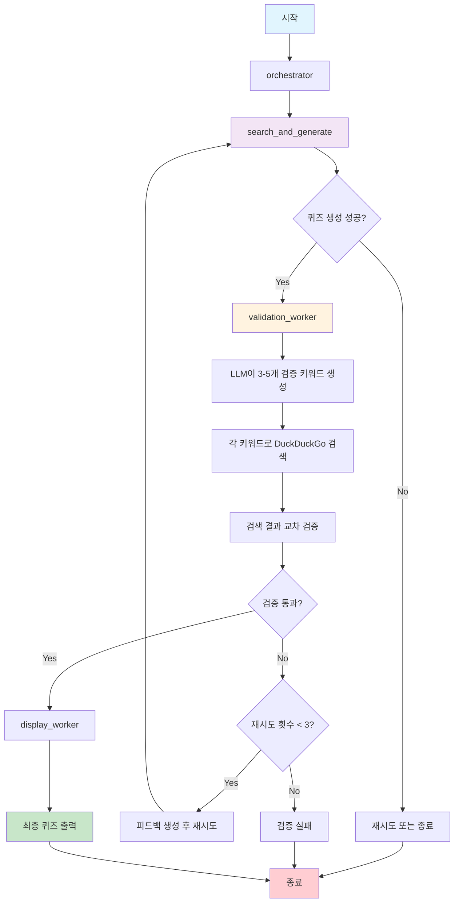

# K-pop Quiz Generator

LangGraph와 Amazon Bedrock을 활용한 K-pop 퀴즈 생성기입니다.

## 주요 기능

- **자동 퀴즈 생성**: K-pop 관련 주제에 대한 객관식 퀴즈 자동 생성
- **다중 키워드 검증**: DuckDuckGo 검색을 통한 퀴즈 정확성 검증
- **LangGraph 워크플로우**: 체계적인 퀴즈 생성 및 검증 프로세스
- **한국어 지원**: 한국어 검색 결과를 통한 정확한 정보 검증

## 워크플로우 다이어그램



## 시스템 구조

### LangGraph 워크플로우 노드
1. **orchestrator**: 전체 프로세스 조율 및 상태 관리
2. **search_and_generate**: 퀴즈 생성 및 초기 검색
3. **validation_worker**: 다중 키워드 검증 시스템
4. **display_worker**: 최종 결과 출력 및 포맷팅

### 검증 시스템 특징
- LLM이 퀴즈 내용을 분석하여 3-5개의 검증 키워드 생성
- 각 키워드로 개별 DuckDuckGo 검색 실행 (`region="kr-kr"`)
- 검색 결과를 종합하여 교차 검증
- 최대 3번 재시도 메커니즘 (피드백 기반 개선)
- `recursion_limit=200` 설정으로 무한 루프 방지

## 설치 및 실행

### 1. 저장소 클론
```bash
git clone https://github.com/blait/GenAI-quiz-Gen.git
cd GenAI-quiz-Gen
```

### 2. 가상환경 생성 (권장)
```bash
python -m venv myenv
source myenv/bin/activate  # macOS/Linux
# 또는
myenv\Scripts\activate     # Windows
```

### 3. 의존성 설치
```bash
pip install -r requirement.txt
```

### 4. AWS 자격 증명 설정
다음 중 하나의 방법으로 AWS 자격 증명을 설정하세요:

#### 방법 1: AWS CLI 설정
```bash
aws configure
```

#### 방법 2: 환경 변수 설정
```bash
export AWS_ACCESS_KEY_ID=your_access_key
export AWS_SECRET_ACCESS_KEY=your_secret_key
export AWS_DEFAULT_REGION=us-east-1
```

#### 방법 3: .env 파일 생성 (선택사항)
```bash
# .env 파일 생성
AWS_ACCESS_KEY_ID=your_access_key
AWS_SECRET_ACCESS_KEY=your_secret_key
AWS_DEFAULT_REGION=us-east-1
```

### 5. 실행
```bash
python quiz_generator.py
```

## 필요 패키지 (requirement.txt)

```
langgraph
langchain
langchain-aws
boto3
ddgs
opensearch-py
sentence-transformers
```

## 파일 구조

```
GenAI-quiz-Gen/
├── quiz_generator.py      # 메인 퀴즈 생성기 (LangGraph 워크플로우)
├── requirement.txt        # 필요 패키지 목록
├── bts_quiz_output.csv   # 생성된 퀴즈 결과 예시
├── README.md             # 프로젝트 설명서
└── .gitignore           # Git 무시 파일 목록
```

## 사용 예시

프로그램을 실행하면 다음과 같은 과정을 거칩니다:

1. **주제 입력**: K-pop 관련 주제 입력 (예: "BTS", "블랙핑크", "K-pop 역사")
2. **퀴즈 생성**: LLM이 객관식 퀴즈 생성
3. **검증 과정**: 
   - 검증 키워드 자동 생성
   - 한국어 검색 실행
   - 정확성 검증
4. **결과 출력**: 검증된 퀴즈를 CSV 파일로 저장

## 주요 개선사항

- ✅ DuckDuckGo 검색 API를 한국어로 설정 (`region="kr-kr"`)
- ✅ 단일 검색에서 다중 키워드 검증으로 개선
- ✅ Recursion limit을 200으로 증가하여 무한 루프 방지
- ✅ 피드백 기반 재시도 메커니즘 구현
- ✅ 상태 관리 시스템 개선 (`validation_success` 플래그)

## 기술 스택

- **LangGraph**: 워크플로우 관리 및 상태 추적
- **Amazon Bedrock**: LLM 서비스 (Claude 3.5 Sonnet)
- **DuckDuckGo Search**: 실시간 정보 검증
- **Python**: 메인 개발 언어
- **Boto3**: AWS SDK

## 향후 개선 계획

- [ ] Amazon Knowledge Base 또는 OpenSearch를 활용한 중복 검사 시스템
- [ ] 코사인 유사도 기반 정확한 중복 검출
- [ ] 더 다양한 K-pop 주제 지원
- [ ] 웹 인터페이스 추가
- [ ] 퀴즈 난이도 조절 기능

## 문제 해결

### 일반적인 오류

1. **AWS 자격 증명 오류**
   ```
   NoCredentialsError: Unable to locate credentials
   ```
   → AWS 자격 증명을 올바르게 설정했는지 확인하세요.

2. **패키지 설치 오류**
   ```
   pip install 실패
   ```
   → 가상환경을 사용하고 Python 3.8+ 버전인지 확인하세요.

3. **검색 결과 없음**
   → 네트워크 연결을 확인하고 다른 키워드로 시도해보세요.

## 라이선스

MIT License

## 기여

이슈 리포트나 풀 리퀘스트는 언제든 환영합니다!
